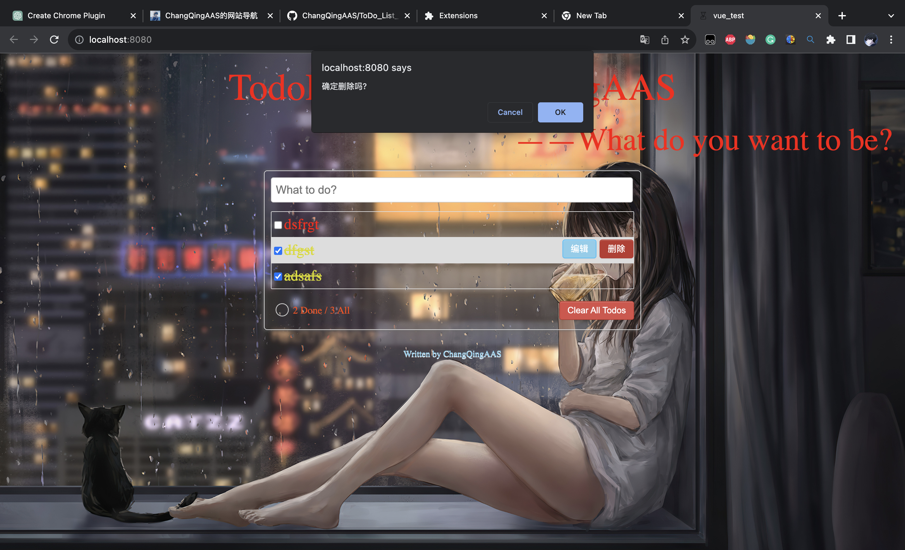
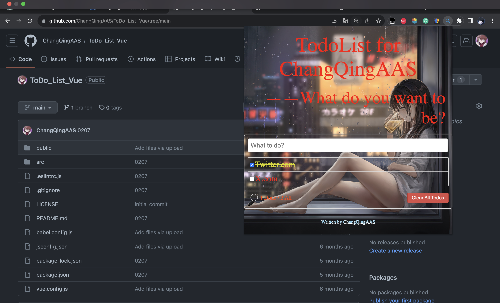

# TODO LIST

## Project setup

```
npm install
```

### Compiles and hot-reloads for development

```
npm run serve
```

### Compiles and minifies for production

```
npm run build
```

### Lints and fixes files

```
npm run lint
```

## 效果图



## 脚手架文件结构

	├── node_modules 
	├── public
	│   ├── favicon.ico: 页签图标
	│   ├── manifest.json: Chrome 插件的清单文件，用于描述插件的基本信息、功能、图标和权限等
	│   └── index.html: 主页面
	├── src
	│   ├── assets: 存放静态资源
	│   │   └── logo.png
	│   │── component: 存放组件
	│   │   └── HelloWorld.vue
	│   │── App.vue: 汇总所有组件
	│   │── main.js: 入口文件
	├── .eslintrc.js: eslint的配置文件
	├── .gitignore: git版本管制忽略的配置
	├── babel.config.js: babel的配置文件
	├── jsconfig.json: 对js的配置
	├── package.json: 应用包配置文件 
	├── package-lock.json：包版本控制文件
	├── README.md: 应用描述文件
    └── vue.config.js: vue的配置文件   

## 总结TodoList案例

1. 组件化编码流程：

       (1).拆分静态组件：组件要按照功能点拆分，命名不要与html元素冲突。

       (2).实现动态组件：考虑好数据的存放位置，数据是一个组件在用，还是一些组件在用：

   1).一个组件在用：放在组件自身即可。

   2). 一些组件在用：放在他们共同的父组件上（<span style="color:red">状态提升</span>）。

       (3).实现交互：从绑定事件开始。

2. props适用于：

       (1).父组件 ==> 子组件 通信

       (2).子组件 ==> 父组件 通信（要求父先给子一个函数）

3. 使用v-model时要切记：v-model绑定的值不能是props传过来的值，因为props是不可以修改的！

4. props传过来的若是对象类型的值，修改对象中的属性时Vue不会报错，但不推荐这样做。

## Vue 项目转Chrome 插件

1. 完善public文件夹，添加用于chrome识别插件信息的manifest.json文件以及相应的图标

2. 对项目打包（npm run build）得到dist文件夹

3. 在Chrome标签页中输入chrome://extensions/，打开扩展程序页面，点击`load unpacked`，选择dist文件夹即可

效果如图：



当然，这是最简单的一种浏览器插件。